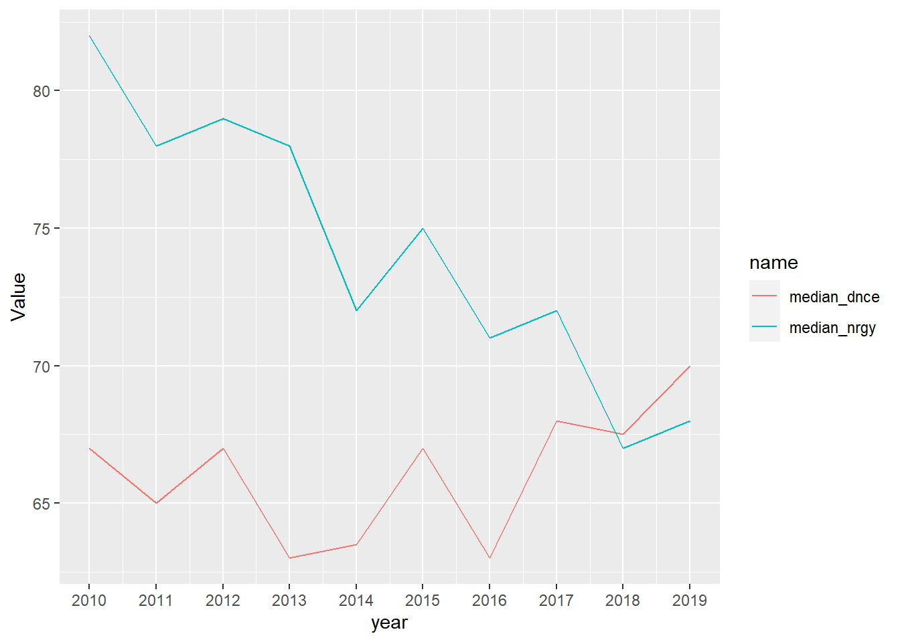

My github repository link is <https://github.com/jiaxin0816/dplyrhomework>


::: {.cell}

:::


## exercise 1

### Question 1


::: {.cell}

:::


The data set contains 584 songs, 184 artists and 50 genres.

### Question 2


::: {.cell}
::: {.cell-output-display}
| year| number|
|----:|------:|
| 2010|     51|
| 2011|     53|
| 2012|     35|
| 2013|     71|
| 2014|     58|
| 2015|     95|
| 2016|     80|
| 2017|     65|
| 2018|     64|
| 2019|     31|
:::
:::


### Question3


::: {.cell}

:::


The most popular artist is Katy Perry, with 17 songs.

### Question4


::: {.cell}
::: {.cell-output-display}
|top genre                 | min_bpm| max_bpm| mean_bpm| median_bpm| num|
|:-------------------------|-------:|-------:|--------:|----------:|---:|
|acoustic pop              |     125|     185| 155.0000|      155.0|   2|
|alaska indie              |     132|     132| 132.0000|      132.0|   1|
|alternative r&b           |     136|     136| 136.0000|      136.0|   1|
|art pop                   |      94|     150| 115.1250|      108.5|   8|
|atl hip hop               |      80|     130| 108.5000|      112.0|   4|
|australian dance          |      87|     192| 128.8333|      115.0|   6|
|australian hip hop        |      95|      95|  95.0000|       95.0|   1|
|australian pop            |     127|     186| 153.8000|      150.0|   5|
|barbadian pop             |      78|     206| 125.3333|      127.0|  15|
|baroque pop               |     108|     184| 146.0000|      146.0|   2|
|belgian edm               |     122|     122| 122.0000|      122.0|   2|
|big room                  |     106|     134| 122.3000|      125.0|  10|
|boy band                  |      77|     160| 116.1333|      120.0|  15|
|british soul              |       0|     164| 109.3333|      108.0|   9|
|brostep                   |     100|     142| 121.0000|      121.0|   2|
|canadian contemporary r&b |      93|     186| 130.0000|      120.0|   7|
|canadian hip hop          |     100|     118| 109.0000|      109.0|   2|
|canadian latin            |      98|      98|  98.0000|       98.0|   1|
|canadian pop              |      65|     192| 122.1290|      119.0|  31|
|candy pop                 |      92|     126| 109.0000|      109.0|   2|
|celtic rock               |      85|      85|  85.0000|       85.0|   1|
|chicago rap               |     125|     125| 125.0000|      125.0|   1|
|colombian pop             |     112|     138| 126.0000|      128.0|   3|
|complextro                |     102|     130| 120.3333|      127.0|   6|
|contemporary country      |      86|      86|  86.0000|       86.0|   1|
|dance pop                 |      43|     202| 118.5975|      120.0| 323|
|danish pop                |     120|     120| 120.0000|      120.0|   1|
|detroit hip hop           |      82|      87|  84.5000|       84.5|   2|
|downtempo                 |     100|     167| 133.5000|      133.5|   2|
|edm                       |      90|     118| 103.0000|      102.0|   4|
|electro                   |     100|     116| 108.0000|      108.0|   2|
|electro house             |     124|     124| 124.0000|      124.0|   1|
|electronic trap           |      96|     100|  98.0000|       98.0|   2|
|electropop                |      90|     160| 112.8462|      103.0|  13|
|escape room               |      96|     158| 127.0000|      127.0|   2|
|folk-pop                  |      75|      86|  80.5000|       80.5|   2|
|french indie pop          |     123|     123| 123.0000|      123.0|   1|
|hip hop                   |      80|     112|  93.7500|       91.5|   4|
|hip pop                   |      93|     111| 100.6667|       98.5|   6|
|hollywood                 |      92|      92|  92.0000|       92.0|   1|
|house                     |     122|     122| 122.0000|      122.0|   1|
|indie pop                 |     148|     155| 151.5000|      151.5|   2|
|irish singer-songwriter   |     129|     129| 129.0000|      129.0|   1|
|latin                     |      94|     186| 140.7500|      141.5|   4|
|metropopolis              |     127|     127| 127.0000|      127.0|   1|
|moroccan pop              |     110|     110| 110.0000|      110.0|   1|
|neo mellow                |      76|     138| 109.1111|      116.0|   9|
|permanent wave            |     125|     148| 137.2500|      138.0|   4|
|pop                       |      77|     190| 116.8727|      116.0|  55|
|tropical house            |     120|     139| 129.5000|      129.5|   2|
:::
:::


### Question5


::: {.cell}
::: {.cell-output .cell-output-stdout}
```
# A tibble: 10 × 3
    year median_nrgy median_dnce
   <int>       <dbl>       <dbl>
 1  2010          82        67  
 2  2011          78        65  
 3  2012          79        67  
 4  2013          78        63  
 5  2014          72        63.5
 6  2015          75        67  
 7  2016          71        63  
 8  2017          72        68  
 9  2018          67        67.5
10  2019          68        70  
```
:::
:::


### Question6


::: {.cell}

:::

::: {.cell}
::: {.cell-output-display}
{width=672}
:::
:::


## Exercise2

### Question1


::: {.cell}
::: {.cell-output .cell-output-stdout}
```
# A tibble: 12 × 3
# Groups:   Marital status [6]
   `Marital status`  Gender median_age
   <fct>             <fct>       <dbl>
 1 single            Male         20  
 2 single            Female       19  
 3 married           Male         37  
 4 married           Female       34  
 5 divorced          Male         40.5
 6 divorced          Female       38  
 7 widower           Male         43  
 8 widower           Female       21  
 9 facto union       Male         34  
10 facto union       Female       27  
11 legally separated Male         55  
12 legally separated Female       41  
```
:::
:::


### Question2


::: {.cell}
::: {.cell-output-display}
|Marital status    | Male| Female|
|:-----------------|----:|------:|
|single            | 20.0|     19|
|married           | 37.0|     34|
|divorced          | 40.5|     38|
|widower           | 43.0|     21|
|facto union       | 34.0|     27|
|legally separated | 55.0|     41|
:::
:::


### Question3


::: {.cell}
::: {.cell-output .cell-output-stdout}
```
# A tibble: 3 × 13
  Target   Curricular units 1st …¹ Curricular units 1st…² Curricular units 1st…³
  <fct>                      <dbl>                  <dbl>                  <dbl>
1 Dropout                    0.609                   5.82                   7.75
2 Graduate                   0.847                   6.67                   8.28
3 Enrolled                   0.508                   5.96                   9.34
# ℹ abbreviated names: ¹​`Curricular units 1st sem (credited)`,
#   ²​`Curricular units 1st sem (enrolled)`,
#   ³​`Curricular units 1st sem (evaluations)`
# ℹ 9 more variables: `Curricular units 1st sem (approved)` <dbl>,
#   `Curricular units 1st sem (grade)` <dbl>,
#   `Curricular units 1st sem (without evaluations)` <dbl>,
#   `Curricular units 2nd sem (credited)` <dbl>, …
```
:::
:::


### Question4


::: {.cell}

:::

::: {.cell}
::: {.cell-output-display}
|Units                                  | Dropout| Graduate| Enrolled|
|:--------------------------------------|-------:|--------:|--------:|
|Curricular units 1st sem (credited)    |    0.61|     0.85|     0.51|
|Curricular units 1st sem (enrolled)    |    5.82|     6.67|     5.96|
|Curricular units 1st sem (evaluations) |    7.75|     8.28|     9.34|
:::
:::